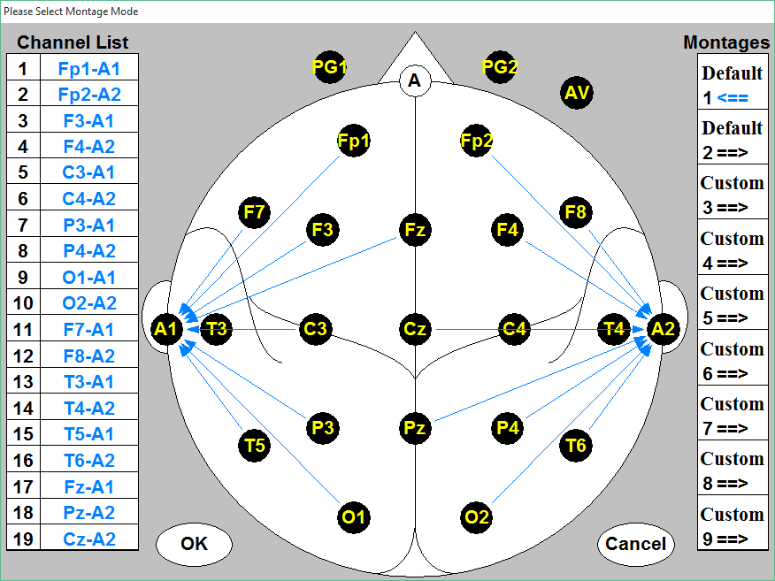
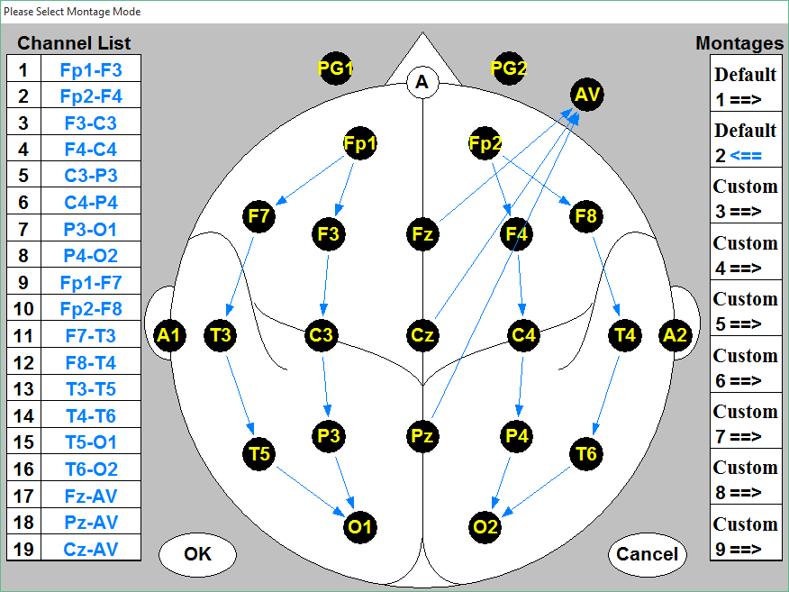
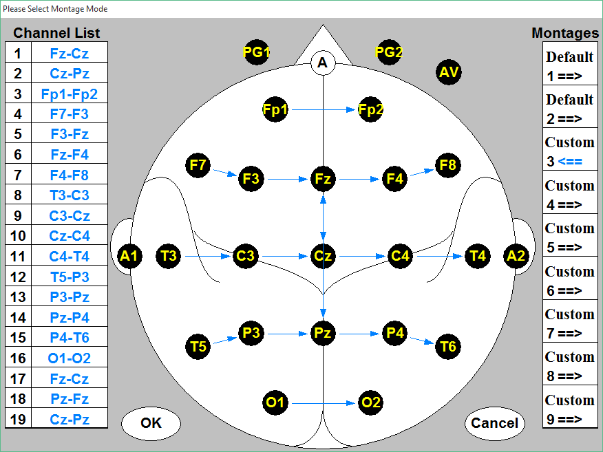
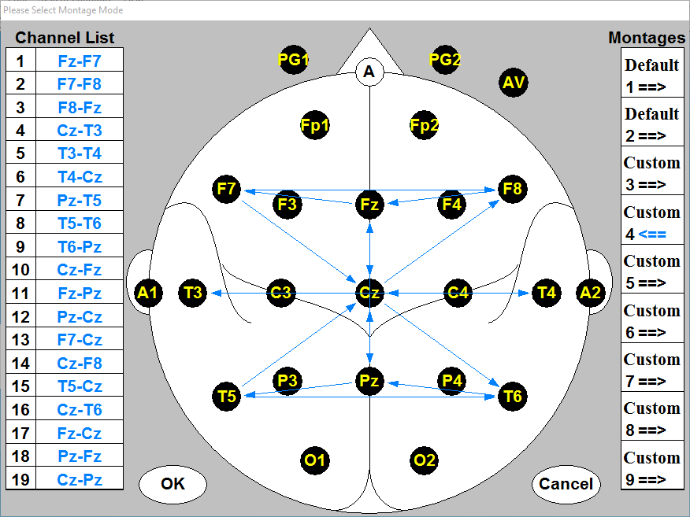
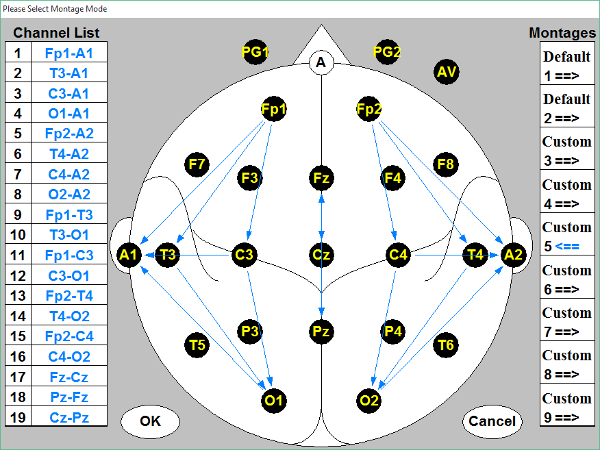
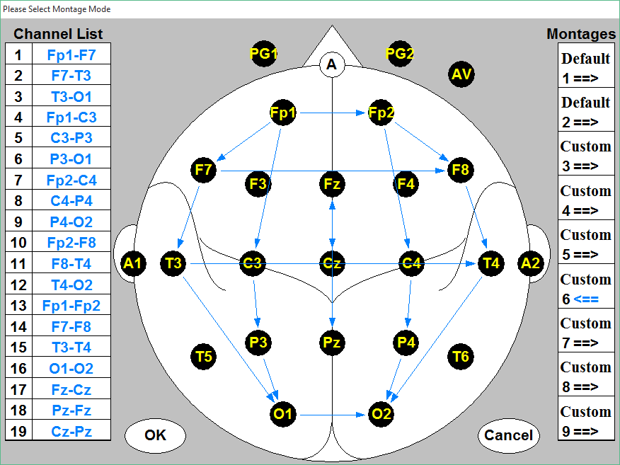
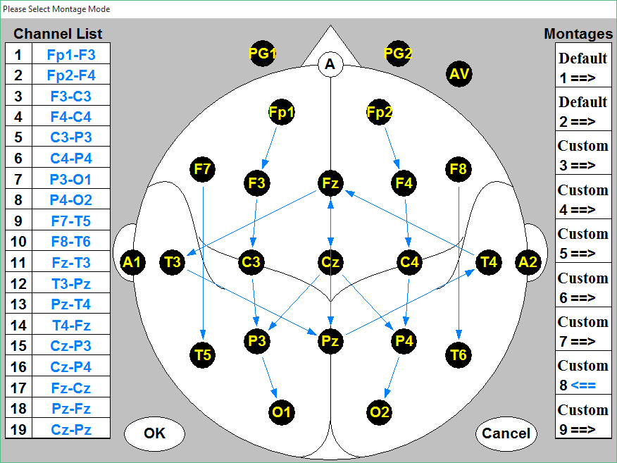
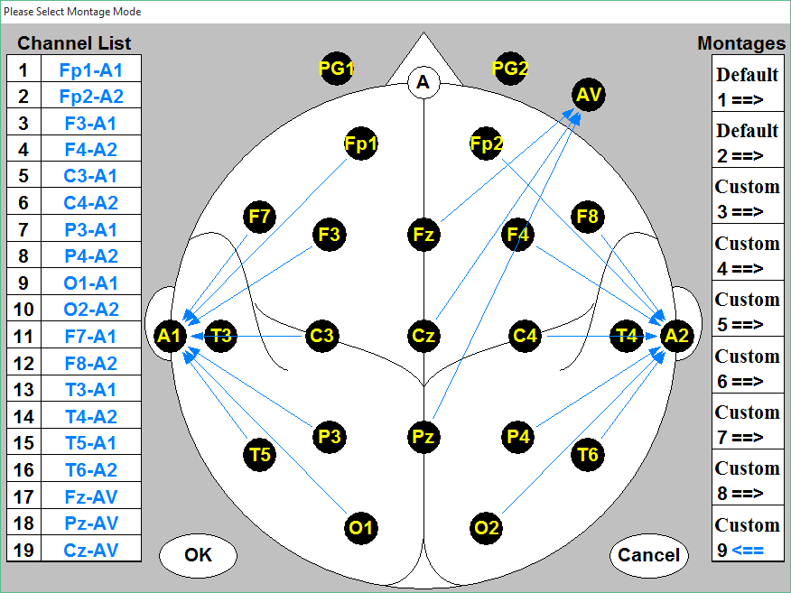
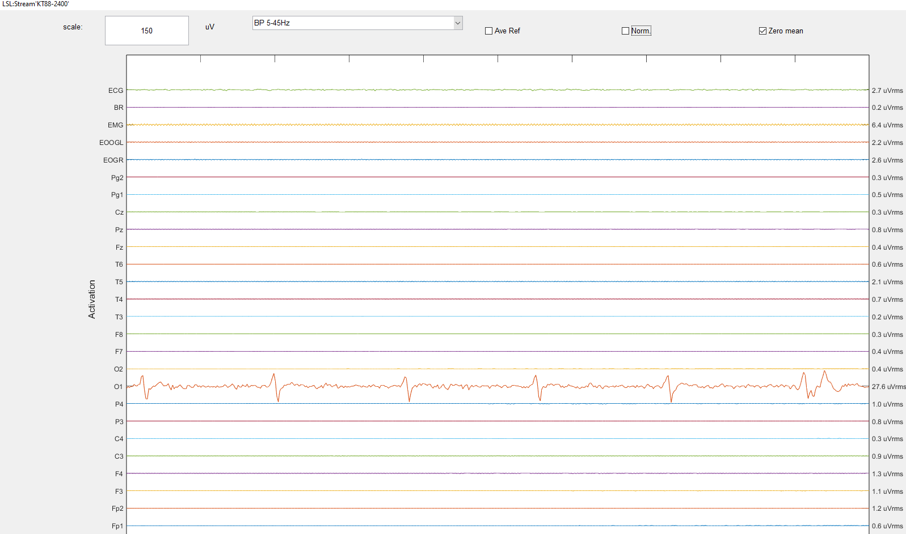

# Contec KT88-2400 EEG C# Driver

**Author:** Sandro Gantenbein
**Maintainer / Contact:** [(info@brainli.ch)]  
**Last Update:** January 20, 2025  

This repository contains a C# driver for the **Contec KT88-2400 EEG device**, enabling you to:

1. **Open** and **configure** the device over a serial port (COMx).  
2. **Start** and **stop** data acquisition.  
3. **Set** references, montages, and hardware filters.  
4. **Read** raw EEG samples from 26 channels in real time.  
5. **Stream** the EEG data via the **LabStreamingLayer (LSL)** for integration with other software (e.g., OpenViBE, BCILAB, LabRecorder).

---

## Table of Contents

1. [Features](#features)  
1. [Usage Overview](#usage-overview)  
1. [Channel Info](#channel-info)  
1. [Troubleshooting](#troubleshooting)  
1. [Montage](#Montage)  
1. [Tests](#Tests)  
---

## Features

- **Serial Communication** at 921600 baud with the KT88-2400 device.  
- **Reference Selection** (A1, A2, AA, AVG, Cz, BN).  
- **Montage Configuration** (9 built-in montage setups).  
- **Hardware Filter** enable/disable (0.5–35 Hz).  
- **Impedance Check** start/stop to measure electrode contact quality.  
- **OnDataReceived Event** that provides 26 channels of EEG as `float[]`.  
- **Simple LSL Integration** to push data in real time.

---

## Usage Overview

Driver initialisation: 

```
using ContecKT88_2400_Driver; // The namespace for the driver

// 1) Create driver instance
var eegDevice = new ContecKT88_2400();

// 2) Open the device on a COM port (replace "COM3" with your actual port)
bool opened = eegDevice.Open("COM3");
if(!opened) {
    Console.WriteLine("[ERROR] Cannot open device on COM3.");
    return;
}
Console.WriteLine("[INFO] Device opened successfully.");

// 3) Send default config
eegDevice.SendDefaultConfiguration();
```
Subscribe to the data event:
```
eegDevice.OnDataReceived += (float[] data) =>
{
    // data.Length == 26
    // handle EEG sample here, please use a software-filter BP 2-45 Hz!
};
```
Start acquisition:
```
eegDevice.StartAcquisition();
```
Stop acquisition:
```
eegDevice.StopAcquisition();
```

Close the device when done:

```
eegDevice.Close();
```

---

## Channel Info

| Index | Channel |
|-------|---------|
| 0     | Fp1     |
| 1     | Fp2     |
| 2     | F3      |
| 3     | F4      |
| 4     | C3      |
| 5     | C4      |
| 6     | P3      |
| 7     | P4      |
| 8     | O1      |
| 9     | O2      |
| 10    | F7      |
| 11    | F8      |
| 12    | T3      |
| 13    | T4      |
| 14    | T5      |
| 15    | T6      |
| 16    | Fz      |
| 17    | Pz      |
| 18    | Cz      |
| 19    | Pg1     |
| 20    | Pg2     |
| 21    | EOGR    |
| 22    | EOOGL   |
| 23    | EMG     |
| 24    | BR      |
| 25    | ECG     |

---

## Troubleshooting

### Device Not Found / Unable to Open COM Port

- Check that the KT88 is plugged in and recognized by your OS.
- Verify the COM port in Device Manager and use the correct port name.
- Corrupted Data

### Make sure you’ve installed the correct baud rate (921600).
- Avoid sending other commands while data is streaming.
- Check your cables and electrode connections.
- LSL “BadImageFormatException”

### You likely have a 32-bit vs. 64-bit mismatch.
- If you installed SharpLSL.Native.win-x64, ensure your app is built as x64.
Excessive Noise

### Properly prep the scalp, use electrode gel/paste, and verify impedance is low.
- Ensure the environment is not full of 50 Hz or 60 Hz interference.
- Make sure your reference/ground connections are stable.

---

## Montages









 

---

## Tests

- it's important to also filter the data by software with a bandpass filter (2-45 Hz) to remove noise.


Each channel was tested



